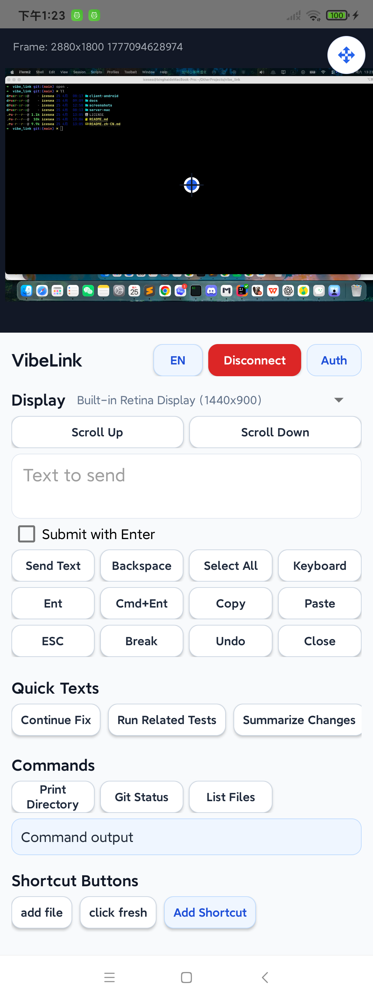
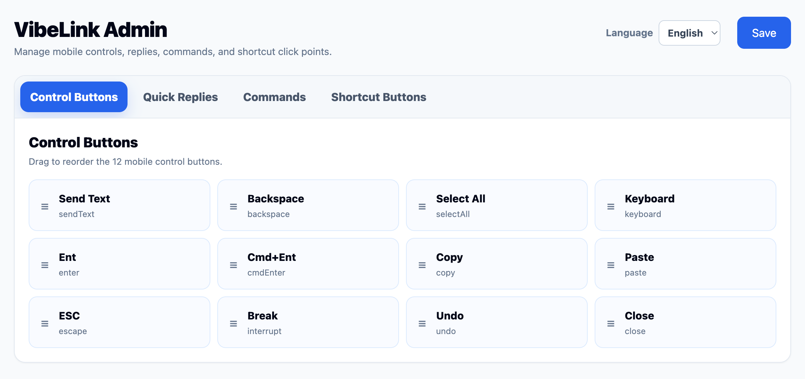
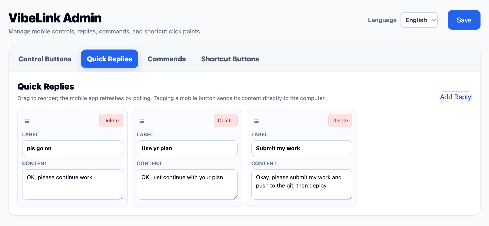
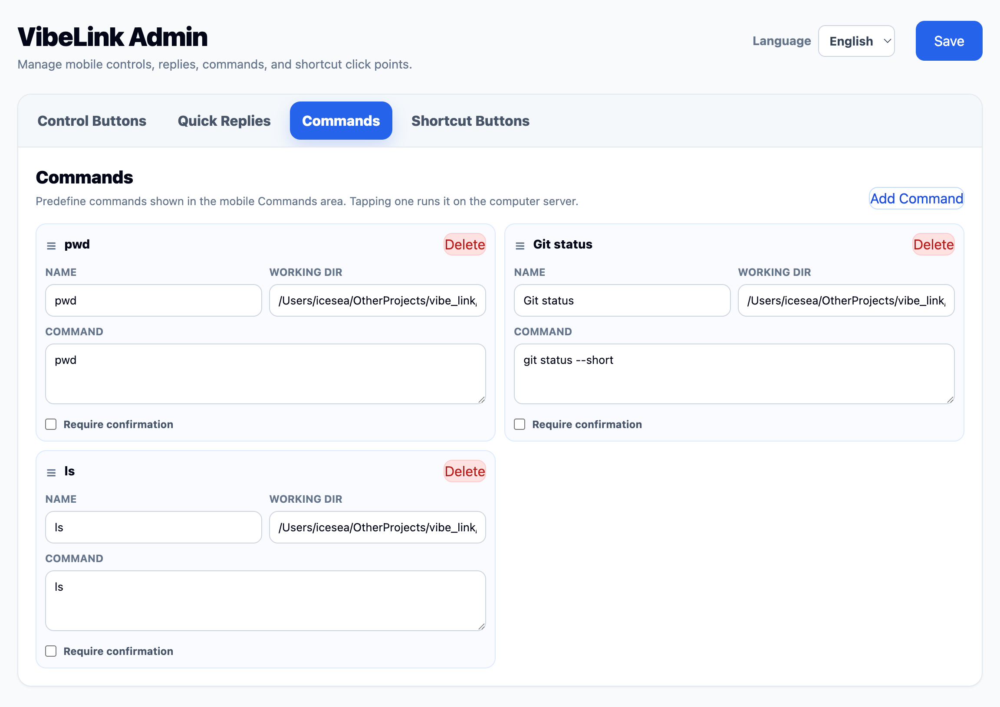
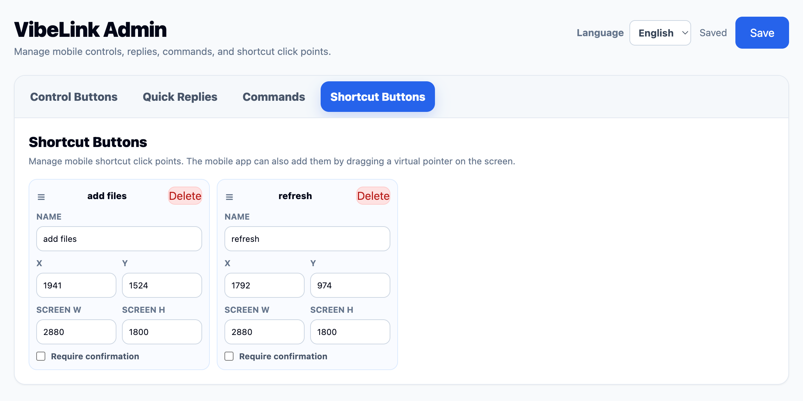
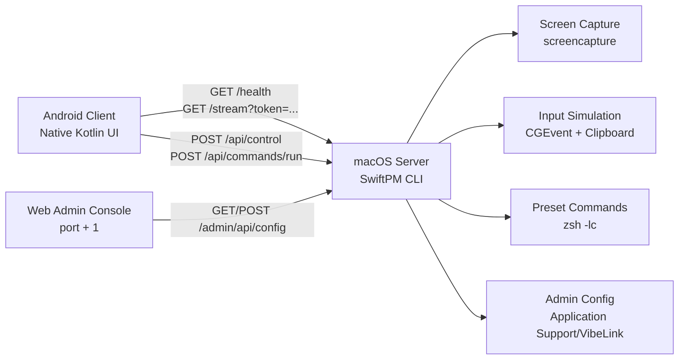

<p align="center">
  
</p>

<h1 align="center">VibeLink</h1>

<p align="center">
  <a href="LICENSE"></a>
  <a href="server-mac"></a>
  <a href="client-android"></a>
</p>

VibeLink is a phone-first remote development controller for macOS. It lets an Android phone view a Mac screen, send precise pointer and keyboard actions, paste text into the active app, trigger saved click points, and run preconfigured development commands over a local network.

The project is currently an end-to-end MVP. It is intentionally lightweight: a Swift command-line server on macOS, a native Android client, MJPEG-over-HTTP screen streaming, and JSON APIs protected by a shared token. The Android client and web admin console both support English and Chinese UI.

[中文 README](README.zh-CN.md)

## Contents

- [Features](#features)
- [Positioning and Comparison](#positioning-and-comparison)
- [Who It Is For](#who-it-is-for)
- [Development Background](#development-background)
- [Screenshots](#screenshots)
- [Architecture](#architecture)
- [Repository Layout](#repository-layout)
- [Requirements](#requirements)
- [Quick Start](#quick-start)
- [HTTP API](#http-api)
- [Security Model](#security-model)
- [Development](#development)
- [Roadmap](#roadmap)
- [License](#license)

## Features

- **Live Mac screen stream**: the macOS server captures the display with `screencapture` and serves it as an MJPEG stream.
- **Display selection**: the server exposes active macOS displays and the Android client can switch streams by display.
- **Three mobile interaction modes**: screen view, pointer click mode, and trackpad mode.
- **Remote input control**: tap, double tap, right click, drag, scroll, cursor move, relative trackpad movement, and common keyboard shortcuts.
- **Text paste workflow**: send text to the current Mac focus through clipboard paste, with an optional Enter key.
- **Mobile keyboard bridge**: type from the Android soft keyboard and forward characters, backspace, and Enter to the Mac.
- **Bilingual UI**: switch the Android client between English and Chinese, with localized built-in action labels and status messages.
- **Localized admin console**: manage presets from a web console with a persistent English/Chinese language selector.
- **Quick texts**: reusable prompts or snippets that can be sent from the phone.
- **Preconfigured commands**: run server-side command presets and poll command output from Android.
- **Shortcut buttons**: save named screen coordinates and trigger them later from the phone.
- **Web admin console**: manage mobile control buttons, quick replies, command presets, and shortcut points at the admin port.
- **Adaptive Android launcher icon**: packaged app icon with a consistent English launcher label.
- **Local-first MVP**: designed for same-LAN use with explicit token authentication.

## Positioning and Comparison

VibeLink is not trying to replace every remote desktop product or cloud IDE. It targets a narrower workflow: a developer has a Mac already running local tools, AI coding agents, browsers, terminals, previews, and permission dialogs, and wants a phone-friendly way to observe and steer that workflow while away from the keyboard.

| Tool category | Typical examples | What they are best at | Gap in mobile remote development | What VibeLink does differently |
| --- | --- | --- | --- | --- |
| SSH and terminal-first access | OpenSSH, Mosh, Tailscale SSH | Fast, scriptable command-line access to a machine | No direct visibility into IDEs, browsers, desktop prompts, AI tool UIs, or graphical state | Combines a live Mac screen with phone-triggered input, text paste, shortcuts, and preset commands |
| Remote IDE / editor workflows | VS Code Remote Development, JetBrains Gateway-style flows | Editing code in a remote environment with local IDE features | Focuses on files and terminals, not on controlling the current Mac desktop session | Keeps the existing Mac session in control, including local apps, browser previews, terminals, and permission dialogs |
| Cloud development environments | GitHub Codespaces and similar cloud IDEs | Reproducible cloud workspaces, browser access, clean project setup | Moves work into a cloud VM and does not control local Mac-only tools or desktop apps | Runs on the user's own Mac and exposes that live desktop workflow to the phone |
| Traditional remote desktop | TeamViewer, AnyDesk, Chrome Remote Desktop, Splashtop | General-purpose full desktop access and support | Mobile interaction often mirrors a desktop mouse model; long prompts, command presets, and dev-specific actions are not first-class | Treats the phone as a development remote control with quick text, keyboard actions, command presets, shortcut points, and focused modes |
| Self-hostable remote desktop | RustDesk, VNC/RDP stacks, Guacamole-style gateways | Owning more of the remote access infrastructure | Still primarily generic remote desktop, with limited awareness of developer workflows | Keeps the scope smaller and developer-specific: screen stream plus control APIs designed for AI coding and local Mac workflows |
| Mobile terminal apps | Termius, Blink, JuiceSSH-style clients | SSH from a phone with good terminal ergonomics | Strong for shell work, weak for inspecting and clicking GUI state | Adds visual feedback and GUI control without giving up command execution shortcuts |

The key distinction is that VibeLink sits between a terminal app and a full remote desktop. It is optimized for short, high-leverage interventions: check what the AI coding tool is doing, paste a refined prompt, click a confirmation, run tests, inspect output, and continue.

## Who It Is For

- Developers using AI coding tools such as Codex, Cursor, Claude Code, Gemini CLI, Aider, or similar agents on a Mac.
- Vibe coding users who want to monitor and nudge long-running coding sessions from a phone.
- macOS developers who need occasional GUI control for browser previews, terminals, IDEs, permission dialogs, and local development servers.
- Privacy-conscious users who prefer LAN-first or private-network access instead of sending an entire desktop workflow through a generic third-party remote desktop service.
- Solo builders and small teams that want a simple open-source foundation for a developer-focused remote control tool.

VibeLink is less suited for full-time remote desktop work, general IT helpdesk support, multiplayer collaboration, file sync, cloud IDE hosting, or replacing a workstation-sized coding environment on a phone.

## Development Background

Modern AI-assisted development changed the shape of remote work. Many sessions now involve starting an agent, watching it edit and test code, then giving small corrections when it gets blocked. The work is not always "open an IDE and type for hours"; often it is "observe, approve, paste, run, click, and redirect."

Traditional remote desktop software can show the screen, but it usually treats the phone as a tiny desktop monitor. Terminal tools are efficient, but they cannot see a browser popup, IDE state, desktop permission prompt, or visual preview. VibeLink was created to cover that middle ground for local Mac development: screen visibility, precise interaction, reusable developer actions, and a lightweight protocol that can evolve from the current MJPEG MVP toward lower-latency transports later.

## Screenshots

<p align="center">
  
</p>

| Control Buttons | Quick Replies |
| --- | --- |
|  |  |

| Commands | Shortcuts |
| --- | --- |
|  |  |

## Architecture



### macOS server

- Directory: `server-mac/`
- Language: Swift 5.9
- Package manager: Swift Package Manager
- Runtime shape: command-line service process
- Default app port: `8765`
- Default admin port: `8766`
- Screen stream: `multipart/x-mixed-replace` MJPEG
- Control channel: HTTP JSON API
- Input simulation: macOS `CGEvent` and clipboard
- Screen capture: `/usr/sbin/screencapture`

### Android client

- Directory: `client-android/`
- Language: Kotlin and Java
- Build system: Gradle Wrapper with Android Gradle Plugin
- Package name: `com.vibelink.client`
- Launcher label: `VibeLink` by default across system languages; the in-app Chinese UI uses `鹊桥` as the localized product name
- Minimum SDK: 26
- Target SDK: 35
- UI: native Android views
- Network layer: standard `HttpURLConnection`
- Stream rendering: multipart MJPEG parsing into `Bitmap`
- Localization: Java-backed text tables, Android string resources, and in-app language toggle

## Repository Layout

```text
.
+-- client-android/        # Android client project
|   +-- app/src/main/      # Native Android app source
|   +-- app/src/test/      # JVM-style controller and text tests
|   +-- app/src/main/res/  # Icons, localized strings, and Android resources
+-- docs/                  # Product, protocol, and task documents
+-- screenshots/           # README and product screenshots
+-- server-mac/            # SwiftPM macOS server project
|   +-- Sources/           # Server executable and core modules
|   +-- Tests/             # Server core unit tests
+-- README.md              # English documentation
+-- README.zh-CN.md        # Chinese documentation
+-- LICENSE                # MIT license
```

## Requirements

### macOS server

- macOS 13 or later
- Swift 5.9 or a recent Xcode Command Line Tools installation
- Screen Recording permission for screen capture
- Accessibility permission for clicks, drags, keyboard events, and paste automation

### Android client

- Android Studio or Android SDK command-line tools
- JDK 17
- Android SDK with API 35 installed
- Android device or emulator running Android 8.0 or later
- Mac and Android device on the same local network for the MVP workflow

## Quick Start

### 1. Run the macOS server

```bash
cd server-mac
swift build
swift run VibeLinkServer --port 8765 --token dev-token
```

The server prints local network URLs, the token, stream URL, and admin URL. If `--token` is omitted, the server generates a random token at startup.

Open the admin console:

```text
http://127.0.0.1:8766/admin
```

Use the same token shown in the server log.

The admin console includes a language selector in the header. The selected language is saved in browser local storage.

### 2. Grant macOS permissions

Open **System Settings > Privacy & Security** and grant the terminal or app running `VibeLinkServer`:

- **Screen Recording** for the screen stream.
- **Accessibility** for pointer events, keyboard events, and text paste.

If the stream is blank or controls do not work, restart the server after changing permissions.

### 3. Build and install the Android client

```bash
cd client-android
./gradlew assembleDebug
./gradlew installDebug
```

Launch VibeLink on Android, enter the Mac LAN URL and token, then tap **Connect**.

Use the language button in the app header to switch between English and Chinese UI text.

Example server URL:

```text
http://192.168.1.10:8765
```

### 4. Verify the server manually

```bash
curl http://127.0.0.1:8765/health
curl -H "Authorization: Bearer dev-token" http://127.0.0.1:8765/api/client-config
curl -H "Authorization: Bearer dev-token" http://127.0.0.1:8765/api/commands
```

## HTTP API

`GET /health` is public and reports server version, stream path, primary screen size, and available displays.

Protected app APIs require:

```http
Authorization: Bearer <token>
```

The stream API accepts the token as a query parameter:

```text
GET /stream?token=<token>&displayId=<display-id>
```

| Method | Path | Description |
| --- | --- | --- |
| `GET` | `/health` | Server health, screen info, and display list |
| `GET` | `/stream?token=<token>` | MJPEG screen stream |
| `GET` | `/api/displays` | Active macOS display list |
| `GET` | `/api/client-config` | Full mobile configuration snapshot |
| `POST` | `/api/control` | Pointer, keyboard, scroll, text, and clipboard actions |
| `GET` | `/api/quick-texts` | Quick text presets |
| `GET` | `/api/control-buttons` | Mobile control button layout |
| `GET` | `/api/commands` | Command presets |
| `POST` | `/api/commands/run` | Start a preset command |
| `GET` | `/api/commands/runs/<runId>` | Read command status and output |
| `GET` | `/api/shortcut-buttons` | Saved shortcut click points |
| `POST` | `/api/shortcut-buttons` | Create or update a shortcut click point |
| `POST` | `/api/shortcut-buttons/run` | Trigger a shortcut click point |
| `GET` | `/admin` | Web admin console |
| `GET` | `/admin/api/config` | Read admin-managed configuration |
| `POST` | `/admin/api/config` | Save admin-managed configuration |

Supported `/api/control` action types include:

```text
tap, doubleTap, rightClick, drag, scroll, text, clipboard,
move, relativeMove, clickCurrent, doubleClickCurrent, rightClickCurrent,
mouseDownCurrent, relativeDrag, mouseUpCurrent,
backspace, enter, cmdEnter, copy, paste, selectAll, escape, interrupt, undo, close
```

## Security Model

VibeLink's MVP is local-first and uses shared-token authentication.

- The server listens on `0.0.0.0` by default so Android devices on the same LAN can connect.
- `GET /health` is unauthenticated.
- `/stream` requires `token=<token>` in the query string.
- JSON APIs require `Authorization: Bearer <token>`.
- Commands are executed only from server-side presets.
- The mobile client cannot submit arbitrary shell commands through the normal command API.
- macOS permissions remain controlled by the operating system.

Do not expose the MVP server directly to the public internet. For remote use, prefer a private network such as Tailscale, WireGuard, or another trusted tunnel.

## Development

Run server tests:

```bash
cd server-mac
swift test
```

Build the Android app:

```bash
cd client-android
./gradlew assembleDebug
```

The Android test sources include small JVM-style tests for interaction math, control button defaults, and localization helpers.

Useful documents:

- [Product development document](docs/手机远程开发助手产品开发文档.md)
- [Shared protocol and MVP scope](docs/共享协议与MVP边界.md)
- [Server task breakdown](docs/服务端任务拆解.md)
- [Client task breakdown](docs/客户端任务拆解.md)

## Roadmap

- Replace MJPEG with WebRTC or another lower-latency transport.
- Add stronger pairing with device keys and QR-code onboarding.
- Add end-to-end encryption beyond the current shared-token MVP.
- Support window-level or region-level capture.
- Improve shortcut buttons with accessibility element lookup or visual matching.
- Add richer command audit logs and high-risk command confirmation.
- Add iOS support after the Android MVP stabilizes.

## Contributing

Issues and pull requests are welcome. For code changes, keep the current split between `server-mac/`, `client-android/`, and `docs/`, and include verification notes for the affected side.

## License

VibeLink is released under the [MIT License](LICENSE).
