<p align="center">
  
</p>

<h1 align="center">VibeLink / 鹊桥</h1>

<p align="center">
  <a href="LICENSE"></a>
  <a href="server-mac"></a>
  <a href="client-android"></a>
</p>

VibeLink，中文名“鹊桥”，是一个面向手机端的 macOS 远程开发控制器。它让 Android 手机可以查看 Mac 屏幕、发送精准鼠标与键盘操作、向当前焦点粘贴文本、触发保存的点击点，并通过局域网运行预设开发命令。

当前项目是可端到端运行的 MVP。整体实现保持轻量：macOS 端是 Swift 命令行服务，Android 端是精简的原生客户端，屏幕和窗口串流优先使用 H.264 over WebSocket，并保留 JPEG/MJPEG 回退链路，控制通道使用带共享 token 鉴权的 JSON API。当前 Android APK 仍然只有约 **1.2 MB**，手机端更接近一个聚焦的远程开发遥控器，而不是臃肿的远程桌面套件。Android 客户端和 Web 管理端均支持中英文界面。

[English README](README.md)

## 目录

- [功能特性](#功能特性)
- [定位与对比](#定位与对比)
- [适用人群](#适用人群)
- [开发背景](#开发背景)
- [截图](#截图)
- [架构](#架构)
- [仓库结构](#仓库结构)
- [环境要求](#环境要求)
- [快速开始](#快速开始)
- [HTTP API](#http-api)
- [安全模型](#安全模型)
- [开发](#开发)
- [路线图](#路线图)
- [许可证](#许可证)

## 功能特性

- **低延迟 Mac 串流画面**：macOS 服务端可采集整个显示器或单个窗口，并通过 WebSocket 输出 H.264 Annex-B 视频，同时保留 JPEG WebSocket 和 MJPEG 回退链路。
- **显示器与窗口串流源选择**：服务端暴露当前 macOS 显示器和可见窗口列表，Android 客户端提供更适合手指点击的大尺寸 Source 选择面板。
- **三种手机交互模式**：屏幕查看模式、指针点击模式、触摸板模式。
- **低延迟丢帧策略**：Android H.264 播放器使用独立读线程持续排空 socket，丢弃过期帧，并从最新关键帧恢复。
- **远程输入控制**：支持点击、双击、右键、拖动、滚动、移动光标、相对触摸板移动和常用键盘快捷键。
- **文本粘贴流程**：将手机端文本发送到 Mac 当前输入焦点，可选自动回车。
- **移动端键盘桥接**：使用 Android 软键盘输入，并把字符、退格、回车转发到 Mac。
- **超轻量 Android 客户端**：当前 APK 约 **1.2 MB**，安装和更新都很轻。
- **双语客户端界面**：Android 客户端可在英文和中文之间切换，内置动作标签、状态信息和空状态文案均已本地化。
- **自动发现与扫码配对**：服务端在局域网中广播自身信息，并提供配对元数据，Android 客户端可通过发现或扫码自动填充连接信息。
- **macOS 权限状态**：管理端展示屏幕录制和辅助功能权限状态，并给出设置引导。
- **双语管理端**：Web 管理端提供可持久化的中英文语言选择器。
- **快捷文本**：保存常用 prompt、命令片段和调试说明，一键从手机发送。
- **预设命令**：从手机执行服务端预设命令，并轮询查看命令输出。
- **快捷按钮**：保存命名屏幕坐标，后续可从手机一键触发。
- **窗口感知输入映射**：绝对点击、长按拖动、快捷点击点和键盘动作会根据当前选择的显示器或窗口串流源映射。
- **Web 管理端**：通过管理端配置移动端控制按钮、快捷回复、命令预设和快捷点击点。
- **Android 自适应启动图标**：提供应用 logo 和启动图标，安装后的系统应用名默认保持英文 `VibeLink`。
- **局域网优先 MVP**：默认面向同一局域网连接，并使用显式 token 鉴权。

## 定位与对比

VibeLink 并不是要替代所有远程桌面产品或云端 IDE。它瞄准的是一个更窄、更具体的工作流：开发者的 Mac 已经运行着本地工具、AI 编程代理、浏览器、终端、预览页面和权限弹窗，而用户希望离开键盘后，仍然能用手机高效观察并推动这套开发流程。

| 工具类别 | 代表工具 | 最擅长的场景 | 手机远程开发里的不足 | VibeLink 的差异 |
| --- | --- | --- | --- | --- |
| SSH 和终端优先工具 | OpenSSH、Mosh、Tailscale SSH | 快速、可脚本化地访问远端命令行 | 看不到 IDE、浏览器、桌面弹窗、AI 工具界面和图形状态 | 同时提供 Mac 实时画面、手机输入、文本粘贴、快捷按钮和预设命令 |
| 远程 IDE / 编辑器工作流 | VS Code Remote Development、JetBrains Gateway 类工作流 | 在远程环境中编辑代码，并保留本地 IDE 体验 | 主要围绕文件和终端，不负责控制当前 Mac 桌面会话 | 直接控制已有 Mac 会话，包括本地应用、浏览器预览、终端和权限提示 |
| 云端开发环境 | GitHub Codespaces 等云 IDE | 可复现的云端工作区、浏览器访问、干净的项目配置 | 工作迁移到云 VM，无法接管本地 Mac 专属工具和桌面应用 | 保留用户自己的 Mac 开发环境，并把真实桌面工作流暴露给手机 |
| 传统远程桌面 | TeamViewer、AnyDesk、Chrome Remote Desktop、Splashtop | 通用完整桌面访问和远程支持 | 手机端通常只是复刻桌面鼠标模型，长 prompt、命令预设和开发快捷操作不是核心能力 | 把手机当成开发遥控器，内置快捷文本、键盘动作、命令预设、快捷点击点和多种交互模式 |
| 可自托管远程桌面 | RustDesk、VNC/RDP、Guacamole 类网关 | 更可控的远程桌面基础设施 | 本质仍是通用远程桌面，对开发工作流感知有限 | 缩小范围并聚焦开发者：屏幕流加控制 API，围绕 AI 编程和本地 Mac 工作流设计 |
| 手机终端应用 | Termius、Blink、JuiceSSH 类客户端 | 在手机上获得较好的 SSH 终端体验 | 适合 shell，不适合观察和点击 GUI 状态 | 在保留命令执行快捷入口的同时，补上可视反馈和图形界面控制 |

VibeLink 的核心区别在于它位于“手机终端”和“完整远程桌面”之间。它优化的不是长时间在手机上写代码，而是短时间、高价值的介入：查看 AI 编程工具状态、粘贴修正 prompt、点击确认、运行测试、查看输出，然后让开发流程继续推进。

## 适用人群

- 在 Mac 上使用 Codex、Cursor、Claude Code、Gemini CLI、Aider 等 AI 编程工具的开发者。
- 希望在手机上监控和推动长时间 AI 编程任务的 vibe coding 用户。
- 需要偶尔控制浏览器预览、终端、IDE、权限弹窗和本地开发服务的 macOS 开发者。
- 更重视隐私和可控性的用户，希望优先使用局域网或私有网络，而不是把完整桌面工作流交给通用第三方远程桌面服务。
- 想基于开源项目扩展“开发者专用远程控制台”的个人开发者和小团队。

VibeLink 不适合替代全天候远程桌面办公、通用 IT 帮助台、多人协作、文件同步、云端 IDE 托管，也不适合把手机变成完整工作站级编码环境。

## 开发背景

AI 辅助开发改变了远程工作的形态。很多开发会话现在是：启动一个编程代理，观察它修改和测试代码，在它卡住时给出少量修正。用户并不总是需要“打开 IDE 连续写几个小时代码”，更多时候需要的是“观察、批准、粘贴、运行、点击、纠偏”。

传统远程桌面能显示画面，但通常把手机当成一个很小的桌面显示器。终端工具很高效，但看不到浏览器弹窗、IDE 状态、桌面权限提示或页面预览。VibeLink 正是为本地 Mac 开发流程中的中间地带而设计：既能看到屏幕，又能精准交互；既能发送文本和快捷动作，也提供面向短时远程介入的 H.264 优先轻量传输链路。

## 截图

<p align="center">
  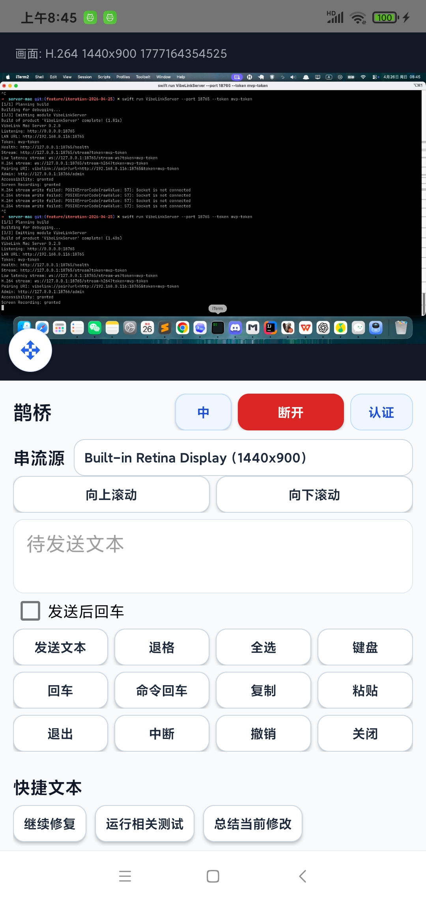
</p>

| 串流源选择器 | 控制面板 |
| --- | --- |
| 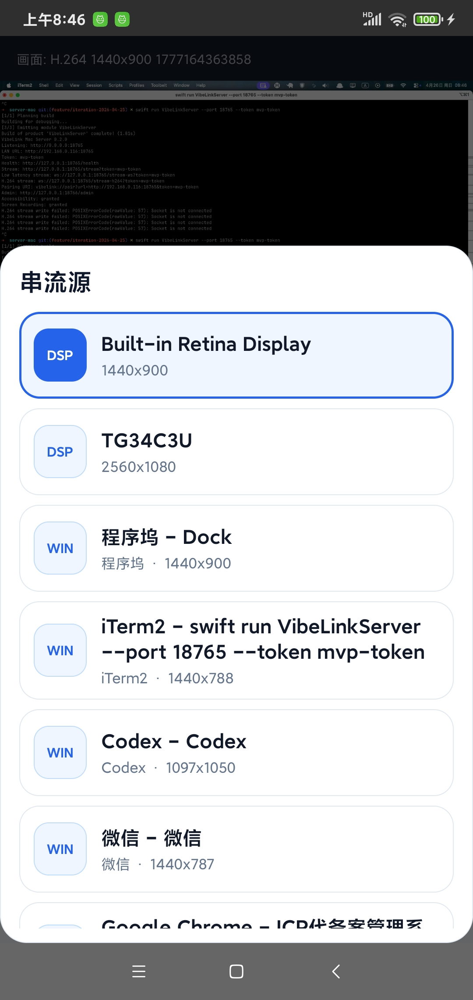 | 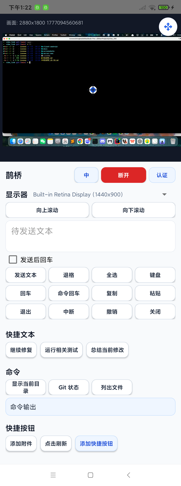 |

| 管理端串流源 | 权限状态 |
| --- | --- |
| 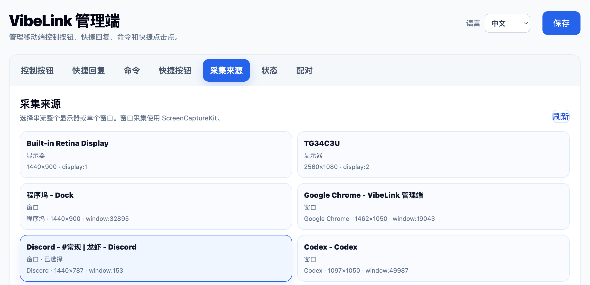 | 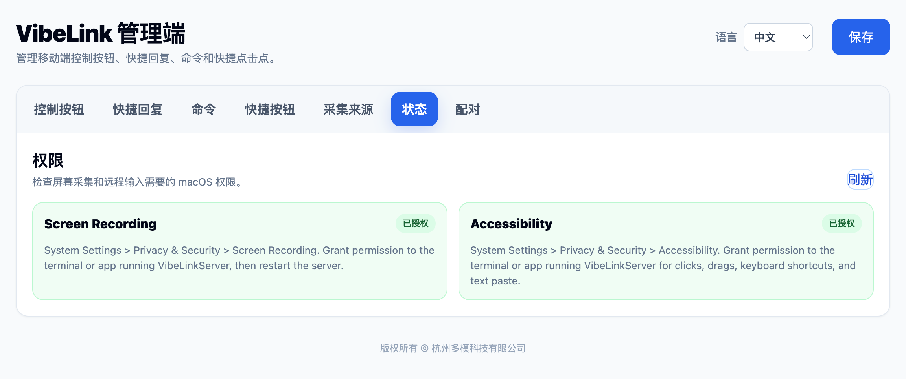 |

| 配对 | 控制按钮 |
| --- | --- |
| 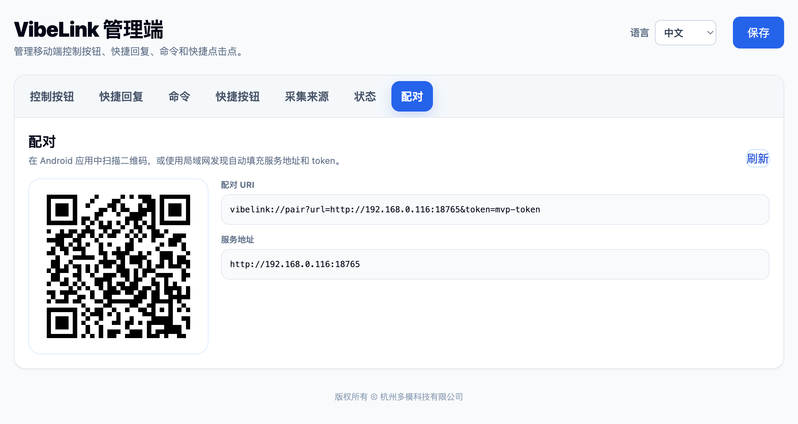 | 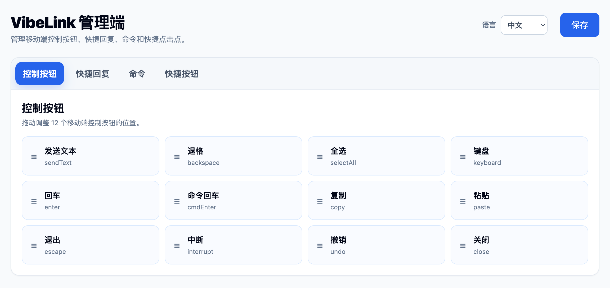 |

| 快捷回复 | 命令 |
| --- | --- |
| 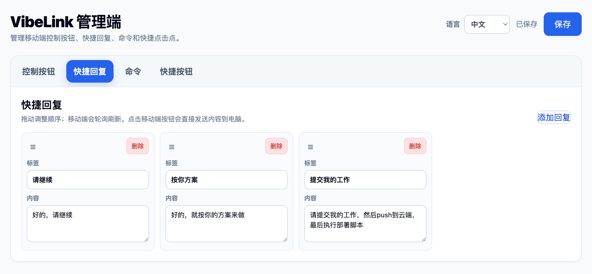 | 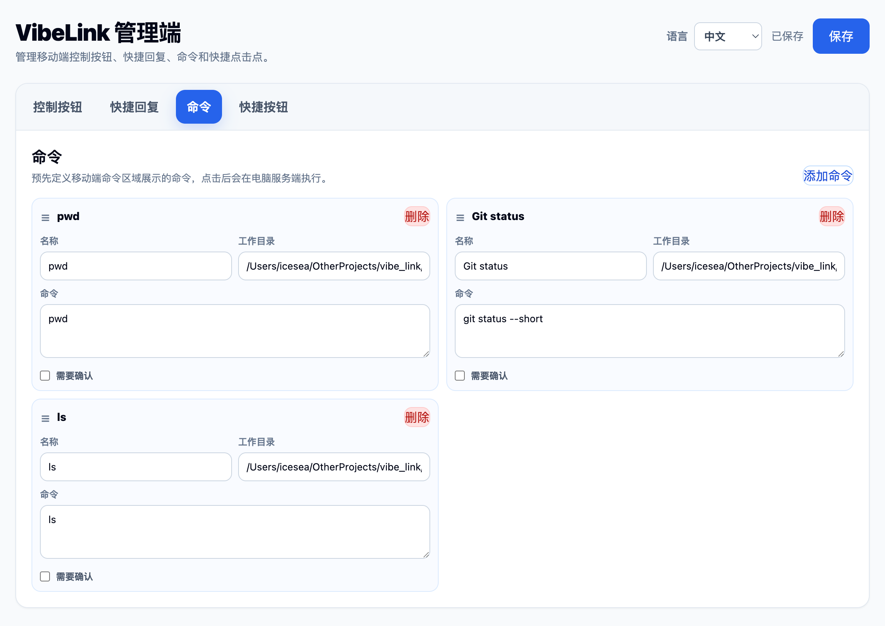 |

| 快捷按钮 |
| --- | --- |
| 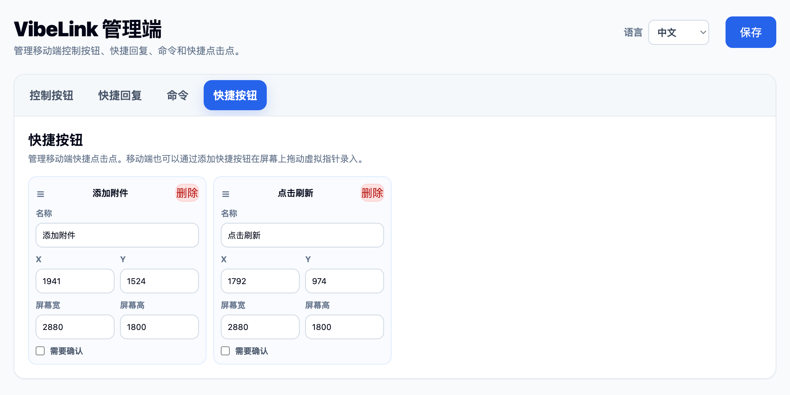 |

## 架构

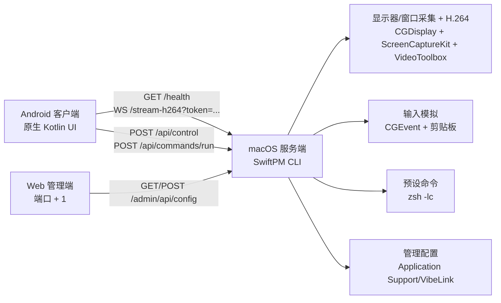

### macOS 服务端

- 目录：`server-mac/`
- 语言：Swift 5.9
- 包管理：Swift Package Manager
- 运行形态：命令行服务进程
- 默认应用端口：`8765`
- 默认管理端口：`8766`
- 串流源：完整显示器采集或单窗口采集
- 屏幕流：H.264 Annex-B over WebSocket、JPEG WebSocket 回退、MJPEG HTTP 回退
- 控制通道：HTTP JSON API
- 输入模拟：macOS `CGEvent` 与剪贴板
- 采集：显示器使用 `CGDisplayCreateImage`，窗口使用 ScreenCaptureKit，H.264 编码使用 VideoToolbox

### Android 客户端

- 目录：`client-android/`
- 语言：Kotlin 与 Java
- 构建系统：Gradle Wrapper + Android Gradle Plugin
- 包名：`com.vibelink.client`
- 系统启动器应用名：默认保持 `VibeLink`；应用内中文界面使用 `鹊桥` 作为产品中文名
- 最低 SDK：26
- 目标 SDK：35
- UI：原生 Android View
- 网络层：标准 `HttpURLConnection`
- 画面渲染：通过 `MediaCodec` 将 H.264 解码到 `TextureView`，并保留 bitmap 回退流
- 串流源选择器：面向触控优化的显示器/窗口选择弹窗，支持结构化标签和当前项高亮
- 本地化：Java 文案表、Android 字符串资源和应用内语言切换

## 仓库结构

```text
.
├── client-android/        # Android 客户端工程
│   ├── app/src/main/      # 原生 Android 应用源码
│   ├── app/src/test/      # 交互控制与文案相关测试
│   └── app/src/main/res/  # 图标、本地化字符串和 Android 资源
├── docs/                  # 产品、协议和任务拆解文档
├── screenshots/           # README 与产品截图
├── server-mac/            # SwiftPM macOS 服务端工程
│   ├── Sources/           # 服务端入口与核心模块
│   └── Tests/             # 服务端核心单元测试
├── README.md              # 英文文档，默认 README
├── README.zh-CN.md        # 中文文档
└── LICENSE                # MIT 许可证
```

## 环境要求

### macOS 服务端

- macOS 13 或更高版本
- Swift 5.9 或较新的 Xcode Command Line Tools
- 屏幕录制权限，用于采集屏幕画面
- 辅助功能权限，用于点击、拖动、键盘事件和文本粘贴自动化

### Android 客户端

- Android Studio 或 Android SDK 命令行工具
- JDK 17
- 已安装 Android SDK API 35
- Android 8.0 或更高版本的真机或模拟器
- MVP 工作流默认要求 Mac 和 Android 设备处于同一局域网

## 快速开始

### 1. 启动 macOS 服务端

```bash
cd server-mac
swift build
swift run VibeLinkServer --port 8765 --token dev-token
```

服务启动后会打印本机局域网 URL、token、屏幕流地址和管理端地址。如果省略 `--token`，服务端会在启动时生成随机 token。

打开管理端：

```text
http://127.0.0.1:8766/admin
```

登录时使用服务端日志里显示的同一个 token。

管理端顶部提供语言选择器，选择结果会保存在浏览器 local storage 中。

### 2. 授予 macOS 权限

打开 **系统设置 > 隐私与安全性**，为运行 `VibeLinkServer` 的终端或应用授予：

- **屏幕录制**：用于屏幕流。
- **辅助功能**：用于鼠标事件、键盘事件和文本粘贴。

如果画面为空或控制无效，修改权限后请重启服务端。

### 3. 构建并安装 Android 客户端

```bash
cd client-android
./gradlew assembleDebug
./gradlew installDebug
```

在 Android 上打开 VibeLink，使用 **Find** 或 **Scan** 自动填充 Mac 局域网地址和 token，然后点击 **Connect**。也可以在 **Auth** 中继续手动输入地址和 token。

应用标题栏中的语言按钮可在英文和中文界面之间切换。

服务地址示例：

```text
http://192.168.1.10:8765
```

### 4. 手动验证服务端

```bash
curl http://127.0.0.1:8765/health
curl -H "Authorization: Bearer dev-token" http://127.0.0.1:8765/api/client-config
curl -H "Authorization: Bearer dev-token" http://127.0.0.1:8765/api/commands
```

## HTTP API

`GET /health` 是公开接口，会返回服务版本、屏幕流路径、主屏幕尺寸和显示器列表。

受保护的应用 API 需要携带：

```http
Authorization: Bearer <token>
```

屏幕流 API 通过查询参数携带 token：

```text
GET /stream?token=<token>&displayId=<display-id>
```

| 方法 | 路径 | 说明 |
| --- | --- | --- |
| `GET` | `/health` | 服务健康状态、屏幕信息和显示器列表 |
| `GET` | `/stream?token=<token>` | MJPEG 回退屏幕流 |
| `GET` | `/stream-ws?token=<token>` | JPEG WebSocket 回退屏幕流 |
| `GET` | `/stream-h264?token=<token>` | H.264 Annex-B WebSocket 屏幕流 |
| `GET` | `/api/displays` | 当前 macOS 显示器列表 |
| `GET` | `/api/capture-sources` | 可用显示器和窗口串流源列表 |
| `POST` | `/api/capture-source` | 选择当前显示器或窗口串流源 |
| `GET` | `/api/permissions` | macOS 权限状态和设置引导 |
| `GET` | `/api/pairing-info` | 局域网地址、token 和二维码配对负载 |
| `GET` | `/api/client-config` | 完整移动端配置快照 |
| `POST` | `/api/control` | 指针、键盘、滚动、文本和剪贴板操作 |
| `GET` | `/api/quick-texts` | 快捷文本预设 |
| `GET` | `/api/control-buttons` | 移动端控制按钮布局 |
| `GET` | `/api/commands` | 命令预设 |
| `POST` | `/api/commands/run` | 启动预设命令 |
| `GET` | `/api/commands/runs/<runId>` | 查询命令状态和输出 |
| `GET` | `/api/shortcut-buttons` | 已保存的快捷点击点 |
| `POST` | `/api/shortcut-buttons` | 创建或更新快捷点击点 |
| `POST` | `/api/shortcut-buttons/run` | 触发快捷点击点 |
| `GET` | `/admin` | Web 管理端 |
| `GET` | `/admin/api/config` | 读取管理端配置 |
| `POST` | `/admin/api/config` | 保存管理端配置 |

`/api/control` 支持的动作类型包括：

```text
tap, doubleTap, rightClick, drag, scroll, text, clipboard,
move, relativeMove, clickCurrent, doubleClickCurrent, rightClickCurrent,
mouseDown, mouseDownCurrent, relativeDrag, mouseUp, mouseUpCurrent,
backspace, enter, cmdEnter, copy, paste, selectAll, escape, interrupt, undo, close
```

## 安全模型

VibeLink MVP 是局域网优先实现，使用共享 token 鉴权。

- 服务端默认监听 `0.0.0.0`，方便同一局域网的 Android 设备连接。
- `GET /health` 不需要鉴权。
- `/stream`、`/stream-ws` 和 `/stream-h264` 需要查询参数 `token=<token>`。
- JSON API 需要 `Authorization: Bearer <token>`。
- 命令只能从服务端预设列表执行。
- 移动端不能通过常规命令 API 提交任意 shell 命令。
- macOS 权限仍由操作系统控制。

不要将当前 MVP 服务端直接暴露到公网。需要远程访问时，建议优先使用 Tailscale、WireGuard 或其他可信私有网络方案。

## 开发

运行服务端测试：

```bash
cd server-mac
swift test
```

构建 Android 应用：

```bash
cd client-android
./gradlew assembleDebug
```

Android 测试源码中包含交互计算、控制按钮默认值和本地化辅助逻辑的小型 JVM 风格测试。

相关文档：

- [产品开发文档](docs/手机远程开发助手产品开发文档.md)
- [共享协议与 MVP 边界](docs/共享协议与MVP边界.md)
- [服务端任务拆解](docs/服务端任务拆解.md)
- [客户端任务拆解](docs/客户端任务拆解.md)

## 路线图

- 评估 WebRTC 或硬件采集链路，在当前 H.264 WebSocket 串流之外获得更好的网络自适应能力。
- 在当前共享 token 配对流程之上加入基于设备密钥的信任机制。
- 在当前共享 token MVP 之外加入更强的端到端加密。
- 继续优化窗口采集过滤、窗口身份匹配，并评估区域级采集。
- 使用无障碍元素查找或图像匹配增强快捷按钮。
- 增加更完整的命令审计日志和高风险命令确认。
- Android MVP 稳定后再评估 iOS 客户端。

## 贡献

欢迎提交 issue 和 pull request。代码修改请保持当前 `server-mac/`、`client-android/`、`docs/` 的职责边界，并在提交说明中写明受影响部分的验证结果。

## 许可证

VibeLink 基于 [MIT License](LICENSE) 开源。
