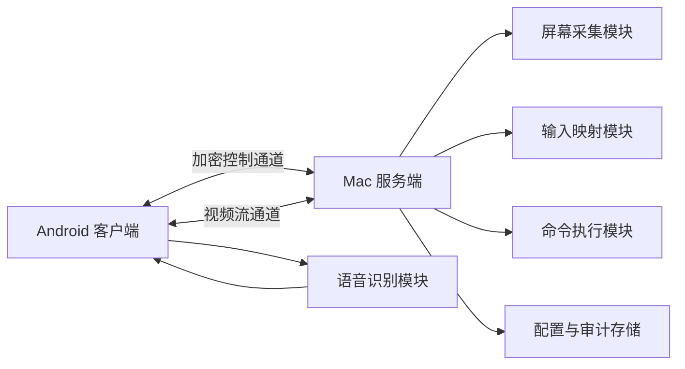

# 手机远程开发助手产品开发文档

## 1. 产品概述

### 1.1 产品名称

暂定名称：**VibeLink 手机远程开发助手**

### 1.2 一句话定位

面向 vibe coding 和远程软件开发场景的手机到 Mac 远程控制工具，提供低延迟屏幕查看、精准交互映射、语音转文字输入、快捷按钮、快捷命令和安全内网连接能力。

### 1.3 核心判断

现有远程桌面工具更偏“看屏幕和鼠标操作”，对开发者高频使用的文字输入、命令行调试、快捷操作、语音输入和隐私安全支持不足。现有 Web coding 或远程终端工具更偏“命令行”，但软件开发完整流程还需要查看 IDE、浏览器、调试页面、点击 UI、操作桌面应用、接管 AI 编程工具等能力。

VibeLink 的核心价值不是再做一个通用远程桌面，而是做一个**以移动端高效控制开发工作流为中心**的远程开发控制台。

## 2. 背景与问题

### 2.1 传统远程桌面的问题

- 手机端文字输入效率低，尤其是长 prompt、命令、代码片段、路径、日志筛选条件等。
- 鼠标点击、拖动、双击虽然可用，但对小屏幕手机不够友好，操作容易误触。
- 远程桌面通常只复制桌面交互模型，没有针对开发场景提供快捷命令、快捷文本、终端执行等能力。
- 内网穿透、远端发现、端到端加密、访问授权、临时会话控制等能力经常依赖第三方云服务，隐私和可控性不足。
- 对 Mac 权限体系、屏幕录制、辅助功能、输入法、剪贴板等开发者常用能力没有形成专门体验。

### 2.2 远程终端和 Web coding 工具的问题

- 命令行体验好，但无法覆盖浏览器调试、页面点击、桌面应用操作、AI 编程工具完整 UI 等场景。
- 不能直接观察图形界面状态，例如弹窗、授权提示、浏览器页面、调试工具、桌面通知、构建器预览等。
- 对“看见问题后立刻点击、输入、继续调试”的闭环支持不足。
- 只靠 CLI 无法完整使用 CodeX、Cursor、Xcode、Android Studio、浏览器 DevTools 等开发工具。

### 2.3 用户机会

对于使用 AI 编程工具的开发者，很多远程操作不是传统意义上的“远程办公”，而是：

- 在手机上查看 AI 编程过程。
- 用语音快速输入需求、修复意见、调试指令。
- 远程执行常用命令，例如启动服务、跑测试、查看日志、重启进程。
- 对浏览器或桌面应用进行少量关键点击。
- 在离开电脑后继续掌控整个开发循环。

这类用户需要的是“手机端开发遥控器”，而不是完整复制桌面电脑体验。

## 3. 产品目标

### 3.1 核心目标

1. 手机端可以稳定查看 Mac 屏幕画面，并支持缩放、平移、点击、双击、拖动等操作。
2. 手机端语音输入自动转文字，并可发送到 Mac 当前输入焦点、指定输入框、剪贴板或 AI 编程工具。
3. Mac 服务端支持配置快捷按钮，将屏幕上的常用位置、菜单、按钮或应用操作保存为手机端快捷动作。
4. Mac 服务端支持预设快捷命令，用户可选择终端应用或 shell 环境远程执行。
5. 支持内网优先连接，并提供安全的远程连接方案，降低对不可信第三方远程桌面服务的依赖。
6. 形成一个可迭代的双端产品架构：Mac 服务端 + Android 客户端。

### 3.2 非目标

MVP 阶段不追求成为通用 TeamViewer 或 AnyDesk 替代品。

MVP 阶段不追求多人协作、文件同步、云端 IDE、在线代码仓库管理或完整设备管理平台。

MVP 阶段不实现 iOS 客户端，优先把 Android 端体验打磨完整。

## 4. 目标用户

### 4.1 核心用户

- 使用 CodeX、Cursor、Claude Code、Gemini CLI、Aider 等 AI 编程工具的个人开发者。
- 经常在 Mac 上进行开发，但希望在离开电脑后继续观察和控制开发任务的用户。
- 希望通过语音输入 prompt、命令和调试信息的 vibe coding 用户。
- 对隐私、安全、内网连接有更高要求，不希望把完整桌面流量暴露给不透明第三方服务的用户。

### 4.2 典型场景

- 通勤、吃饭、躺下休息时查看 Mac 上 AI 编程任务进度。
- 手机语音输入新的需求，让 Mac 上的 AI 编程工具继续执行。
- 远程点击浏览器页面、授权弹窗、终端确认提示或桌面应用按钮。
- 远程运行 `npm run dev`、`pnpm test`、`git status`、`tail -f` 等常用命令。
- 页面调试时通过手机观察画面，并进行少量点击、滚动和输入。

## 5. 产品形态

### 5.1 Mac 服务端

Mac 服务端常驻运行，负责：

- 获取屏幕视频流。
- 编码并推送屏幕画面到 Android 端。
- 接收 Android 端的点击、双击、拖动、滚动、键盘输入、语音转文字结果和快捷动作请求。
- 将远程操作映射到 macOS 的辅助功能、输入事件、剪贴板、终端命令和应用控制。
- 管理设备配对、连接权限、会话状态和安全策略。
- 提供快捷按钮、快捷文本、快捷命令、终端配置和连接配置的管理界面。

### 5.2 Android 客户端

Android 客户端负责：

- 展示 Mac 屏幕视频流。
- 支持单指拖动画面、双指缩放、点击、双击、长按、拖动、滚动等远程控制手势。
- 支持语音输入，自动转文字，并发送到 Mac。
- 提供快捷文本、快捷命令、快捷按钮和会话控制面板。
- 显示当前连接质量、延迟、服务端权限状态和安全提示。
- 支持横屏和竖屏两种操作模式。

## 6. 核心功能设计

### 6.1 屏幕视频流

#### 功能说明

Mac 服务端实时采集屏幕画面，Android 端低延迟展示。用户可以缩放画面查看局部细节，也可以快速回到全屏视图。

#### MVP 要求

- 支持选择显示器。
- 支持 720p 和 1080p 两档清晰度。
- 支持帧率配置：10 FPS、20 FPS、30 FPS。
- 支持画面缩放、平移、适配屏幕。
- 显示实时连接延迟和码率。

#### 后续增强

- 支持窗口级采集。
- 支持区域采集。
- 支持自动根据网络状况降级清晰度和帧率。
- 支持鼠标位置高亮和点击反馈动画。

### 6.2 远程交互映射

#### 功能说明

Android 端手势被转换为 Mac 端鼠标和键盘事件。

#### 手势映射

| Android 操作 | Mac 行为 |
| --- | --- |
| 单击 | 鼠标左键单击 |
| 双击 | 鼠标左键双击 |
| 长按 | 鼠标右键或长按菜单，用户可配置 |
| 单指拖动按钮模式 | 鼠标拖动 |
| 双指拖动 | 画面平移 |
| 双指缩放 | 画面缩放 |
| 双指上下滑动 | 鼠标滚轮 |
| 三指点击 | 显示快捷操作面板 |

#### MVP 要求

- 坐标映射准确，支持缩放后点击真实屏幕位置。
- 支持点击、双击、右键、拖动、滚动。
- 支持“触控板模式”和“直接点击屏幕模式”两种控制方式。
- 支持误触保护，例如拖动开始阈值、点击确认开关。

### 6.3 语音输入与文字发送

#### 功能说明

手机端将语音转为文字，然后发送给 Mac。用户可以选择直接输入到当前焦点、复制到剪贴板、发送到指定应用或追加到快捷文本编辑区。

#### MVP 要求

- Android 端语音识别转文字。
- 支持发送到 Mac 当前焦点输入框。
- 支持发送到 Mac 剪贴板。
- 支持发送前编辑。
- 支持常用标点、换行和代码块输入。
- 支持“发送后自动按 Enter”开关。

#### 后续增强

- 支持本地语音识别和云端语音识别两种模式。
- 支持自定义语音命令，例如“运行测试”“打开浏览器”“粘贴并回车”。
- 支持开发词典，例如仓库名、命令名、框架名、函数名、英文技术词。

### 6.4 快捷文字输入

#### 功能说明

用户在 Android 端快速发送预设文本，例如 prompt 模板、常用命令、代码片段、调试说明。

#### MVP 要求

- 支持创建、编辑、删除快捷文本。
- 支持分组，例如“AI Prompt”“Git”“测试”“部署”“日志”。
- 支持一键发送到当前焦点。
- 支持一键复制到 Mac 剪贴板。
- 支持变量占位符，例如 `{branch}`、`{file}`、`{port}`。

### 6.5 快捷按钮

#### 功能说明

用户可以在 Mac 服务端提前把屏幕上的某些位置或 UI 操作定义为快捷按钮，然后在手机端一键触发。

#### 典型例子

- 点击 CodeX 输入框。
- 点击浏览器刷新按钮。
- 点击终端确认按钮。
- 点击 AI 工具的“继续”或“发送”按钮。
- 打开指定应用或切换到指定窗口。

#### MVP 要求

- Mac 端支持“录制快捷按钮”：用户点击屏幕位置并命名。
- 快捷按钮保存屏幕坐标、显示器信息、目标应用名和备注。
- Android 端显示快捷按钮列表。
- 支持一键执行快捷按钮。
- 执行前可选显示确认提示。

#### 风险与限制

坐标型快捷按钮对窗口移动、分辨率变化和应用布局变化敏感。MVP 可以先实现坐标型按钮，后续再增强为基于窗口、图像识别或无障碍元素识别的按钮。

### 6.6 快捷命令

#### 功能说明

用户在 Mac 服务端预设命令，Android 端一键执行。命令可绑定终端应用、工作目录、环境变量和执行策略。

#### MVP 要求

- 支持配置命令名称、命令内容、工作目录、终端类型、是否需要确认。
- 支持终端类型：系统 Terminal、iTerm2、内置 shell 执行器。
- 支持查看命令执行状态：等待中、运行中、成功、失败。
- 支持查看最近输出。
- 支持中断命令。

#### 安全策略

- 默认所有命令执行前需要确认。
- 高风险命令需要二次确认，例如包含 `rm -rf`、`sudo`、`curl | sh`、磁盘格式化等关键字。
- 支持只允许执行预设命令，不允许手机端任意输入 shell 命令。
- 支持命令审计日志。

### 6.7 连接与配对

#### MVP 连接方式

优先支持局域网连接：

- Mac 服务端展示二维码。
- Android 端扫码配对。
- 配对后保存设备公钥和会话信息。
- 同一局域网内自动发现服务端。

#### 后续连接方式

- Tailscale / WireGuard 网络下连接。
- 自建中继服务。
- WebRTC NAT 穿透。
- 手动输入地址和端口。

#### 安全要求

- 设备配对必须显式授权。
- 会话通信必须加密。
- Mac 端可随时断开设备。
- Mac 端可查看已配对设备并撤销授权。
- 支持临时访问码，过期后自动失效。

## 7. 权限与隐私

### 7.1 Mac 权限

Mac 服务端需要引导用户授予：

- 屏幕录制权限：用于采集屏幕画面。
- 辅助功能权限：用于模拟鼠标、键盘和应用控制。
- 输入监控权限：按实际实现决定，尽量避免不必要权限。
- 本地网络权限：用于局域网发现和连接。

### 7.2 Android 权限

Android 客户端需要：

- 麦克风权限：用于语音输入。
- 网络权限：用于连接 Mac 服务端。
- 相机权限：仅扫码配对时需要。

### 7.3 隐私原则

- 默认不上传屏幕视频到云端。
- 默认不保存屏幕录像。
- 语音识别模式必须明确告知用户是本地识别还是云端识别。
- 快捷命令、连接日志和执行日志只保存在用户设备本地。
- 远程会话开始和结束时，Mac 端应显示明显状态。

## 8. 系统架构

### 8.1 总体架构



### 8.2 Mac 服务端模块

| 模块 | 职责 |
| --- | --- |
| 屏幕采集模块 | 调用 macOS ScreenCaptureKit 或相关 API 获取画面 |
| 视频编码模块 | 将画面编码为适合低延迟传输的视频流 |
| 连接管理模块 | 管理局域网发现、配对、会话、心跳 |
| 控制协议模块 | 接收手机端事件并进行权限校验 |
| 输入映射模块 | 将远程事件转换为 macOS 鼠标、键盘、剪贴板操作 |
| 快捷按钮模块 | 录制、保存、执行屏幕快捷动作 |
| 快捷命令模块 | 管理命令、终端配置、执行状态和输出 |
| 权限引导模块 | 引导用户开启 macOS 必要权限 |
| 审计日志模块 | 记录连接、输入、命令执行等关键事件 |

### 8.3 Android 客户端模块

| 模块 | 职责 |
| --- | --- |
| 视频展示模块 | 解码和展示 Mac 屏幕画面 |
| 手势控制模块 | 处理缩放、平移、点击、拖动、滚动 |
| 语音输入模块 | 语音转文字、编辑、发送 |
| 快捷操作模块 | 展示快捷文本、快捷按钮、快捷命令 |
| 连接管理模块 | 扫码配对、自动发现、重连、断开 |
| 会话状态模块 | 展示延迟、码率、权限、连接状态 |
| 设置模块 | 管理清晰度、帧率、手势偏好、安全选项 |

## 9. 技术选型建议

### 9.1 Mac 服务端

- 开发语言：Swift 优先。
- UI：SwiftUI。
- 屏幕采集：ScreenCaptureKit。
- 输入模拟：Accessibility API、CGEvent。
- 本地存储：SQLite 或 JSON 配置文件，MVP 可先用本地 JSON。
- 终端执行：Process + shell，后续支持 iTerm2 AppleScript 或 Terminal AppleScript。
- 网络通信：WebSocket / QUIC / WebRTC 视实现复杂度选择。

### 9.2 Android 客户端

- 开发语言：Kotlin。
- UI：Jetpack Compose。
- 视频播放：MediaCodec 或 WebRTC 原生渲染。
- 语音识别：Android SpeechRecognizer 作为 MVP；后续支持可插拔引擎。
- 本地存储：Room 或 DataStore。
- 二维码扫描：CameraX + ML Kit。

### 9.3 视频与控制通道建议

MVP 推荐先使用：

- 视频流：WebRTC 或 H.264 over WebSocket。
- 控制通道：WebSocket。
- 局域网发现：Bonjour / mDNS。
- 配对：二维码携带服务地址、临时 token、公钥指纹。

如果团队希望降低实时视频实现难度，可先用 MJPEG 或周期截图流做早期原型，但正式 MVP 应尽快切换到更低延迟、更低带宽的视频方案。

## 10. 数据模型

### 10.1 配对设备

```json
{
  "id": "device_001",
  "name": "Pixel 9",
  "publicKey": "base64-public-key",
  "createdAt": "2026-04-25T10:00:00+08:00",
  "lastSeenAt": "2026-04-25T12:00:00+08:00",
  "enabled": true
}
```

### 10.2 快捷按钮

```json
{
  "id": "button_001",
  "name": "点击 CodeX 输入框",
  "displayId": "main",
  "x": 1400,
  "y": 920,
  "actionType": "click",
  "targetApp": "Codex",
  "confirmBeforeRun": false,
  "createdAt": "2026-04-25T10:00:00+08:00"
}
```

### 10.3 快捷命令

```json
{
  "id": "command_001",
  "name": "启动前端开发服务",
  "command": "pnpm dev",
  "workingDirectory": "/Users/me/project",
  "runner": "integrated_shell",
  "confirmBeforeRun": true,
  "riskLevel": "normal"
}
```

### 10.4 快捷文本

```json
{
  "id": "text_001",
  "name": "让 AI 继续修复",
  "group": "AI Prompt",
  "content": "继续修复上一个问题，先定位根因，再修改代码并运行相关测试。",
  "sendMode": "focused_input"
}
```

## 11. MVP 范围

### 11.1 MVP 必须包含

Mac 服务端：

- 屏幕采集和视频流推送。
- 局域网配对和连接。
- 鼠标点击、双击、拖动、滚动映射。
- 文字输入到当前焦点。
- 剪贴板写入。
- 快捷按钮录制和执行。
- 快捷命令配置和执行。
- 基础权限引导。
- 基础审计日志。

Android 客户端：

- 扫码配对。
- 屏幕画面展示、缩放、平移。
- 点击、双击、拖动、滚动。
- 语音转文字、编辑、发送。
- 快捷文本发送。
- 快捷按钮触发。
- 快捷命令触发和查看状态。
- 横竖屏适配。

### 11.2 MVP 暂不包含

- 云端账号系统。
- 多用户协同控制。
- iOS 客户端。
- 文件传输。
- 远程音频。
- 完整应用商店分发和企业管理。
- 复杂图像识别式 UI 自动化。

## 12. 版本规划

### 12.1 P0 原型版

目标：验证手机远程控制 Mac 开发流程是否成立。

- Mac 屏幕采集。
- Android 展示画面。
- 局域网连接。
- 基础点击和文字输入。
- 语音转文字发送。
- 单条快捷命令执行。

验收标准：

- 在同一局域网下 Android 可以连接 Mac。
- 手机端能看到 Mac 屏幕。
- 手机点击能映射到 Mac。
- 手机语音文字能输入到 Mac 当前焦点。
- 手机能触发一条预设命令。

### 12.2 P1 MVP 版

目标：形成个人开发者可连续使用的闭环。

- 完整配对流程。
- 多快捷文本、快捷按钮、快捷命令。
- 命令状态和输出展示。
- 横竖屏操作体验。
- 基础安全策略和审计日志。
- 清晰度、帧率、延迟显示。

验收标准：

- 连续远程控制 30 分钟无明显断流。
- 点击坐标在常见缩放比例下保持准确。
- 语音输入从识别到发送在 3 秒内完成。
- 快捷命令执行结果可追踪。
- Mac 端可以撤销 Android 设备授权。

### 12.3 P2 增强版

目标：提升可靠性、安全性和开发场景适配。

- WebRTC 或更稳定的视频传输方案。
- Tailscale / WireGuard 网络连接支持。
- 本地语音识别可选。
- 基于应用窗口的快捷按钮。
- 命令风险识别和二次确认。
- 自定义语音命令。
- 多显示器体验优化。

### 12.4 P3 专业版

目标：成为高频 AI 编程远程工作台。

- AI 编程工具适配模板。
- DevTools、浏览器、终端、IDE 的场景化操作面板。
- 远程任务流编排，例如“拉代码、安装依赖、启动服务、打开浏览器”。
- 会话录像可选本地保存。
- 插件系统。
- 自建中继服务。

## 13. 用户体验原则

1. 手机端不复制完整桌面鼠标体验，而是提供适合手机的开发遥控体验。
2. 语音输入应是一等公民，不能藏在二级菜单里。
3. 快捷操作必须比手动缩放点击更快，否则没有意义。
4. 所有高风险命令必须有明确确认。
5. Mac 端必须让用户清楚知道当前是否正在被远程查看或控制。
6. 默认隐私保护优先，云端能力必须可选且透明。
7. 低延迟优先于极致画质，开发场景中“能及时看清状态并操作”比高清更重要。

## 14. 安全与风控

### 14.1 威胁模型

- 未授权设备连接 Mac。
- 局域网中间人攻击。
- 手机丢失后被他人控制 Mac。
- 快捷命令被误触或恶意触发。
- 屏幕内容泄露。
- 云端语音识别泄露敏感代码或需求。

### 14.2 防护措施

- 首次连接必须扫码配对。
- 配对使用临时 token 和设备公钥。
- 控制通道和视频通道加密。
- 支持 PIN、生物识别或系统锁屏后重新授权。
- 支持只读模式：仅看屏幕，不允许控制。
- 支持命令白名单。
- 支持敏感命令二次确认。
- 支持一键断开全部连接。
- 支持会话日志和命令执行日志。

## 15. 关键难点

### 15.1 低延迟视频流

难点在于 Mac 屏幕采集、编码、传输、Android 解码之间的整体延迟。需要优先做链路监控，分别记录采集耗时、编码耗时、网络耗时和解码耗时。

### 15.2 精准坐标映射

手机端缩放和平移后，用户点击的是画面坐标，需要准确转换为 Mac 真实屏幕坐标。多显示器、不同缩放比例、Retina 像素倍率都会增加复杂度。

### 15.3 macOS 权限体验

屏幕录制和辅助功能权限是硬门槛。产品必须提供清晰引导、权限检测和异常提示，否则用户会误以为连接失败。

### 15.4 快捷按钮稳定性

坐标型按钮实现简单但稳定性弱。MVP 可以接受，但需要在文档和 UI 中说明适用范围，并为后续的窗口级、图像级、无障碍元素级快捷按钮留接口。

### 15.5 命令执行安全

远程执行命令很强大，也很危险。必须从第一版就引入确认、白名单、审计和风险提示，避免后续再补安全体系。

## 16. 成功指标

### 16.1 技术指标

- 局域网连接成功率大于 95%。
- 720p 模式下端到端画面延迟小于 250ms。
- 点击坐标误差小于 8 个物理像素。
- 语音识别到文字发送完成时间小于 3 秒。
- 连续 30 分钟会话无崩溃。

### 16.2 产品指标

- 用户能在 5 分钟内完成首次配对和权限配置。
- 用户能在 10 分钟内创建第一个快捷命令和快捷按钮。
- 用户在手机端完成一次“观察进度、语音输入、点击确认、执行命令”的完整开发闭环。
- 核心用户愿意在真实开发任务中连续使用至少 3 天。

## 17. 开发里程碑

### 第 1 周：技术验证

- Mac 屏幕采集 demo。
- Android 视频展示 demo。
- WebSocket 控制通道 demo。
- 点击坐标映射 demo。
- Android 语音转文字 demo。

### 第 2 周：端到端原型

- 完成局域网连接。
- 完成扫码配对雏形。
- 完成点击、拖动、滚动。
- 完成文字发送到 Mac 当前焦点。
- 完成单条命令执行。

### 第 3-4 周：MVP 功能

- 快捷文本管理。
- 快捷按钮录制与执行。
- 快捷命令管理与状态展示。
- Mac 权限引导。
- Android 主控制台 UI。
- 横竖屏基础适配。

### 第 5 周：稳定性与安全

- 加密配对和会话管理。
- 命令确认和风险提示。
- 审计日志。
- 重连机制。
- 多显示器基础支持。

### 第 6 周：真实场景打磨

- 用 CodeX、Cursor、Terminal、浏览器进行场景测试。
- 修复坐标映射和缩放问题。
- 优化延迟和码率。
- 编写用户使用指南。
- 准备内测版本。

## 18. 测试计划

### 18.1 功能测试

- 局域网扫码配对。
- Mac 权限检测。
- 屏幕画面展示。
- 点击、双击、拖动、滚动。
- 语音输入发送。
- 快捷文本发送。
- 快捷按钮执行。
- 快捷命令执行、中断和状态展示。
- 设备撤销授权。

### 18.2 兼容性测试

- macOS 不同版本。
- 单显示器和多显示器。
- Retina 和非 Retina 缩放。
- Android 不同屏幕比例。
- 横屏和竖屏。
- Wi-Fi、手机热点、VPN 网络。

### 18.3 安全测试

- 未配对设备连接失败。
- token 过期后连接失败。
- 被撤销设备连接失败。
- 高风险命令触发二次确认。
- Mac 锁屏后是否允许继续控制，按配置验证。

### 18.4 场景测试

- 手机语音输入 prompt 到 CodeX。
- 手机触发测试命令并查看输出。
- 手机点击浏览器页面并观察反馈。
- 手机点击 AI 工具继续按钮。
- 手机远程重启开发服务。

## 19. 初始界面建议

### 19.1 Mac 服务端主界面

- 顶部：服务状态、连接状态、当前会话设备。
- 左侧导航：设备、屏幕、快捷按钮、快捷命令、快捷文本、安全、日志。
- 主区：
  - 首次启动显示权限引导。
  - 未配对时显示二维码。
  - 已连接时显示会话状态、延迟、码率、断开按钮。

### 19.2 Android 客户端主界面

- 主区域：远程屏幕画面。
- 底部工具栏：语音、键盘、快捷文本、快捷按钮、快捷命令、设置。
- 悬浮状态条：延迟、清晰度、连接状态。
- 语音输入面板：按住说话或点击开始，识别后可编辑并发送。
- 快捷命令面板：命令列表、运行状态、最近输出。

## 20. 开放决策点

以下问题需要在进入正式开发前确认：

1. 视频流优先选择 WebRTC，还是先用更简单的 H.264 over WebSocket 实现 MVP？
2. Mac 服务端是否需要内置终端输出窗口，还是只调用系统 Terminal / iTerm2？
3. Android 语音识别是否允许默认使用系统云端识别，还是必须优先本地识别？
4. 是否允许公网远程连接进入 MVP，还是 MVP 严格限定局域网和用户自建 VPN？
5. 快捷按钮第一版是否只做坐标型，还是必须支持窗口绑定？

## 21. 推荐实施策略

推荐采用“局域网 MVP + 端侧优先 + 安全默认开启”的路线：

1. 先打通 Mac 到 Android 的屏幕流和控制通道。
2. 再实现语音输入、快捷文本和快捷命令，快速覆盖 vibe coding 高频价值。
3. 快捷按钮第一版采用坐标型实现，保留后续升级接口。
4. 远程公网连接不进入第一版，优先支持局域网和 Tailscale / WireGuard。
5. 从第一版开始加入设备配对、命令确认、撤销授权和审计日志。

这个路线可以较快验证产品价值，同时避免一开始陷入复杂 NAT 穿透、云端账号和大规模远程桌面基础设施建设。

## 22. 验收清单

### 22.1 P0 验收

- [ ] Android 可以通过局域网连接 Mac 服务端。
- [ ] Android 可以看到 Mac 屏幕。
- [ ] Android 点击能映射到 Mac。
- [ ] Android 语音文字能发送到 Mac 当前焦点。
- [ ] Android 可以触发一条 Mac 预设命令。

### 22.2 P1 验收

- [ ] 支持扫码配对和设备授权撤销。
- [ ] 支持屏幕缩放、平移、点击、双击、拖动、滚动。
- [ ] 支持快捷文本管理和发送。
- [ ] 支持快捷按钮录制和执行。
- [ ] 支持快捷命令管理、执行、状态展示和中断。
- [ ] 支持命令执行确认和高风险提示。
- [ ] 支持基础审计日志。
- [ ] 支持横屏和竖屏。
- [ ] 支持连续 30 分钟稳定会话。

## 23. 后续可扩展方向

- iOS 客户端。
- 浏览器 Web 客户端。
- AI 编程工具专用适配器。
- 本地 LLM 语音命令理解。
- 基于图像识别的按钮定位。
- 基于 macOS Accessibility Tree 的控件定位。
- 自建中继服务器。
- 团队版设备和权限管理。
- 可分享的快捷命令模板库。

## 24. 总结

VibeLink 的产品重点是把手机变成面向 AI 编程和软件开发流程的远程控制台。它应优先解决四个关键问题：看得到、点得准、说得快、跑得稳。

第一版不需要覆盖所有远程桌面能力，而要把开发者最常用的闭环做顺：手机查看屏幕，语音输入需求，点击关键 UI，执行常用命令，观察结果并继续迭代。只要这个闭环足够稳定，就能形成区别于传统远程桌面和远程终端工具的核心价值。
